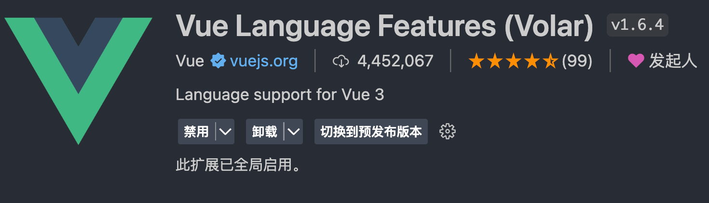
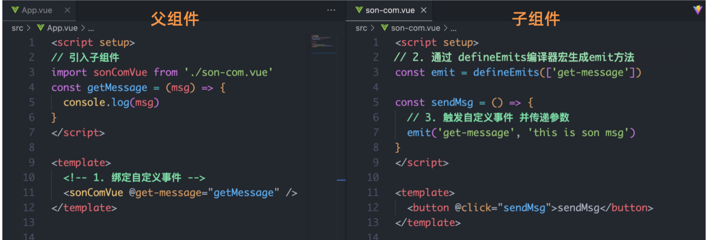
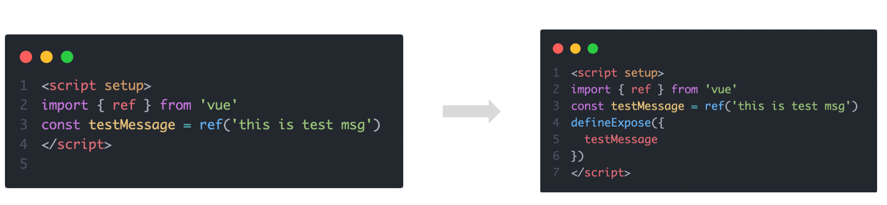
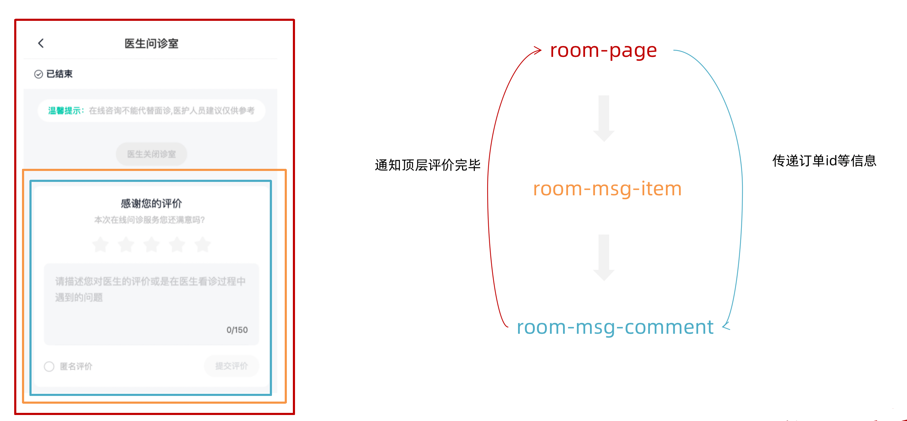
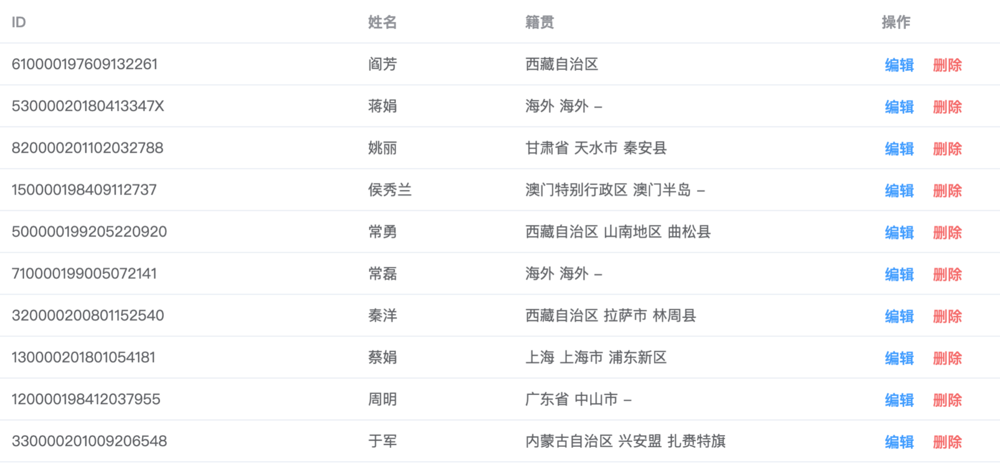

# 认识 Vue3

## 为什么要学 Vue3

1. 框架层面
   1. 响应式底层 API 的变化 Proxy 数组下标的修改 对象动态添加属性
   2. Vue2 对 ts 支持弱 Vue3 增强了对 TS 的支持
   3. Vue3 增加对于组合式 API 增强了对于逻辑组合的能力
   4. 配套的工程化工具也进行了更新 Vue-cli - create-vue Vuex - pinia
2. 市场层面
   1. 市场在扩大 Vue2 最新到 2.7

# 使用 create-vue 搭建 Vue3 项目

[快速上手 | Vue.js](https://cn.vuejs.org/guide/quick-start.html)

> 前置条件 - 已安装 16.0 或更高版本的 Node.js

执行如下命令，这一指令将会安装并执行 create-vue

```bash
npm init vue@latest
```


> 注意：避免在中文目录下创建项目

# 更改 Vetur 工具为 Volar

> 启用最新的 Volar 工具，禁用原本的 Vetur 工具



# 熟悉项目和关键文件

## create-vue

> create-vue 是 Vue 官方新的脚手架工具，底层切换到了 vite （下一代前端工具链），为开发提供极速响应


## 关键文件


# Vue3 组合式 API 体验

> 通过 Counter 案例 体验 Vue3 新引入的组合式 API

```vue
<script>
export default {
  data() {
    return {
      count: 0,
    };
  },
  methods: {
    addCount() {
      this.count++;
    },
  },
};
</script>
<template>
  <!-- 不再限制唯一根元素 -->
  <div>
    <button @click="setCount">{{ count }}</button>
  </div>
</template>
```

```vue
<script>
import { ref } from "vue";
export default {
  setup() {
    // 在这里写组合式API
    // 响应式数据
    const count = ref(0);
    // 修改数据的方法
    const setCount = () => {
      count.value++;
    };
    // 模版中用哪些数据和方法 以对象的写法return
    return {
      count,
      setCount,
    };
  },
};
</script>

<template>
  <!-- 不再限制唯一根元素 -->
  <div>
    <button @click="setCount">{{ count }}</button>
  </div>
</template>
```

#

# 组合式 API - setup 选项

## 1. setup 选项的写法和执行时机

写法

```vue
<script>
export default {
  setup() {},
  beforeCreate() {},
};
</script>
```

执行时机

> 在 beforeCreate 钩子之前执行


## 2. setup 中写代码的特点

> 在 setup 函数中写的数据和方法需要在末尾以对象的方式 return，才能给模版使用

```vue
<script>
export default {
  setup() {
    const message = "this is message";
    const logMessage = () => {
      console.log(message);
    };
    // 必须return才可以
    return {
      message,
      logMessage,
    };
  },
};
</script>
```

## 3. <script setup>语法糖

> script 标签添加 setup 标记之后
>
> 1. 不再需要写 export default {}
> 2. 不再需要 return
> 3. 组件也无需注册直接使用

```vue
<script setup>
const message = "this is message";
const logMessage = () => {
  console.log(message);
};
</script>
```

# 组合式 API - reactive 和 ref 函数

## 1. reactive

> 接受对象类型数据的参数传入并返回一个响应式的对象

```vue
<script setup>
// 导入
import { reactive } from "vue";
// 执行函数 传入参数 变量接收
const state = reactive({
  msg: "this is msg",
});
const setSate = () => {
  // 修改数据更新视图
  state.msg = "this is new msg";
};
</script>

<template>
  {{ state.msg }}
  <button @click="setState">change msg</button>
</template>
```

## 2. ref

> 接收简单类型或者对象类型的数据传入并返回一个响应式的对象

```vue
<script setup>
// 导入
import { ref } from "vue";
// 执行函数 传入参数 变量接收
const count = ref(0);
const setCount = () => {
  // 修改数据更新视图必须加上.value
  count.value++;
};
</script>

<template>
  <button @click="setCount">{{ count }}</button>
</template>
```

## 3. reactive 对比 ref

1. 都是用来生成响应式数据
2. 不同点
   1. reactive 不能处理简单类型的数据
   2. ref 参数类型支持更好，但是必须通过.value 做访问修改
   3. ref 函数内部的实现依赖于 reactive 函数
3. 在实际工作中的推荐
   1. 推荐使用 ref 函数，减少记忆负担

# 组合式 API - computed

> 计算属性基本思想和 Vue2 保持一致，组合式 API 下的计算属性只是修改了 API 写法

```vue
<script setup>
// 导入
import { ref, computed } from "vue";
// 原始数据
const count = ref(0);
// 计算属性
const doubleCount = computed(() => count.value * 2);

// 原始数据
const list = ref([1, 2, 3, 4, 5, 6, 7, 8]);
// 计算属性list
const filterList = computed(() => {
  return list.value.filter((item) => item > 2);
});
</script>
```

# 组合式 API - watch

> 侦听一个或者多个数据的变化，数据变化时执行回调函数，俩个额外参数 immediate 控制立刻执行，deep 开启深度侦听

## 1. 侦听单个数据

```vue
<script setup>
// 1. 导入watch
import { ref, watch } from "vue";
const count = ref(0);
// 2. 调用watch 侦听变化
watch(count, (newValue, oldValue) => {
  console.log(`count发生了变化，老值为${oldValue},新值为${newValue}`);
});
</script>
```

## 2. 侦听多个数据

> 侦听多个数据，第一个参数可以改写成数组的写法

```vue
<script setup>
// 1. 导入watch
import { ref, watch } from 'vue'
const count = ref(0)
const name = ref('cp')
// 2. 调用watch 侦听变化
watch([count, name], ([newCount, newName],[oldCount,oldName])=>{
  console.log(`count或者name变化了，[newCount, newName],[oldCount,oldName])
})
</script>
```

## 3. immediate

> 在侦听器创建时立即出发回调，响应式数据变化之后继续执行回调

```vue
<script setup>
// 1. 导入watch
import { ref, watch } from "vue";
const count = ref(0);
// 2. 调用watch 侦听变化
watch(
  count,
  (newValue, oldValue) => {
    console.log(`count发生了变化，老值为${oldValue},新值为${newValue}`);
  },
  {
    immediate: true,
  }
);
</script>
```

## 4. deep

> 通过 watch 监听的 ref 对象默认是浅层侦听的，直接修改嵌套的对象属性不会触发回调执行，需要开启 deep

```vue
<script setup>
// 1. 导入watch
import { ref, watch } from "vue";
const state = ref({ count: 0 });
// 2. 监听对象state
watch(state, () => {
  console.log("数据变化了");
});
const changeStateByCount = () => {
  // 直接修改不会引发回调执行
  state.value.count++;
};
</script>

<script setup>
// 1. 导入watch
import { ref, watch } from "vue";
const state = ref({ count: 0 });
// 2. 监听对象state 并开启deep
watch(
  state,
  () => {
    console.log("数据变化了");
  },
  { deep: true }
);
const changeStateByCount = () => {
  // 此时修改可以触发回调
  state.value.count++;
};
</script>
```

# 组合式 API - 生命周期函数

## 1. 选项式对比组合式


## 2. 生命周期函数基本使用

> 1. 导入生命周期函数
> 2. 执行生命周期函数，传入回调

```vue
<scirpt setup>
import { onMounted } from 'vue'
onMounted(()=>{
  // 自定义逻辑
})
</script>
```

## 3. 执行多次

> 生命周期函数执行多次的时候，会按照顺序依次执行

```vue
<scirpt setup>
import { onMounted } from 'vue'
onMounted(()=>{
  // 自定义逻辑
})

onMounted(()=>{
  // 自定义逻辑
})
</script>
```

# 组合式 API - 父子通信

## 1. 父传子

> 基本思想
>
> 1. 父组件中给子组件绑定属性
> 2. 子组件内部通过 props 选项接收数据


## 2. 子传父

> 基本思想
>
> 1. 父组件中给子组件标签通过@绑定事件
> 2. 子组件内部通过 emit 方法触发事件



# 组合式 API - 模版引用

> 概念：通过 ref 标识 获取真实的 dom 对象或者组件实例对象

## 1. 基本使用

> 实现步骤：
>
> 1. 调用 ref 函数生成一个 ref 对象
> 2. 通过 ref 标识绑定 ref 对象到标签


## 2. defineExpose

> 默认情况下在 <script setup>语法糖下组件内部的属性和方法是不开放给父组件访问的，可以通过 defineExpose 编译宏指定哪些属性和方法容许访问
> 说明：指定 testMessage 属性可以被访问到



# 组合式 API - provide 和 inject

## 1. 作用和场景

> 顶层组件向任意的底层组件传递数据和方法，实现跨层组件通信



## 2. 跨层传递普通数据

> 实现步骤
>
> 1. 顶层组件通过 `provide` 函数提供数据
> 2. 底层组件通过 `inject` 函数提供数据


## 3. 跨层传递响应式数据

> 在调用 provide 函数时，第二个参数设置为 ref 对象


## 4. 跨层传递方法

> 顶层组件可以向底层组件传递方法，底层组件调用方法修改顶层组件的数据


# 综合案例



## 1. 项目地址

```bash
git clone  http://git.itcast.cn/heimaqianduan/vue3-basic-project.git
```

## 2. 项目说明

1. 模版已经配置好了案例必须的安装包
2. 案例用到的接口在 README.MD 文件 中
3. 案例项目有俩个分支，main 主分支为开发分支，complete 分支为完成版分支供开发完参考
